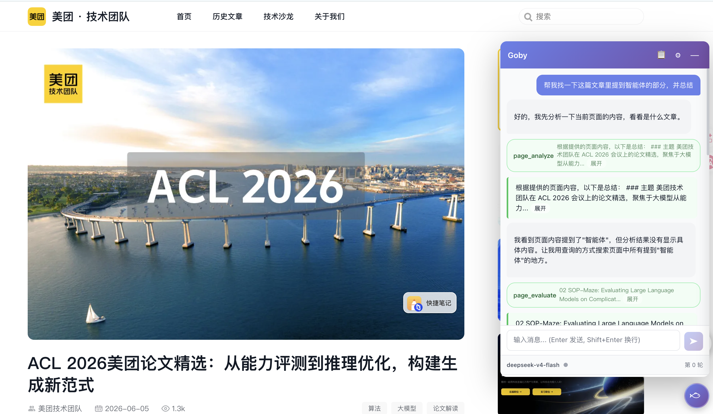
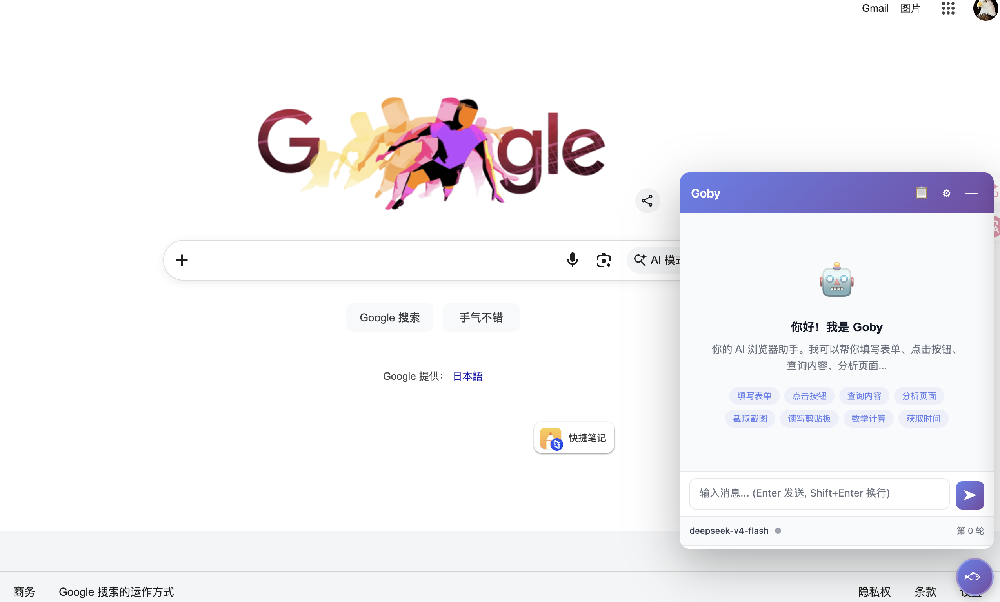
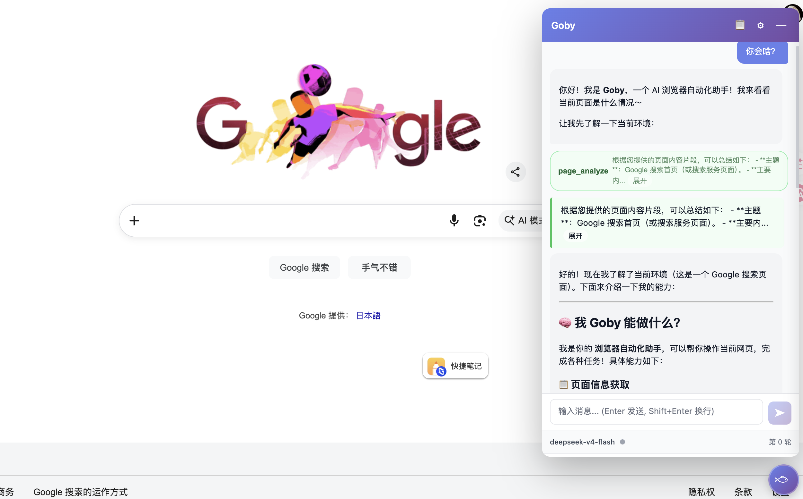
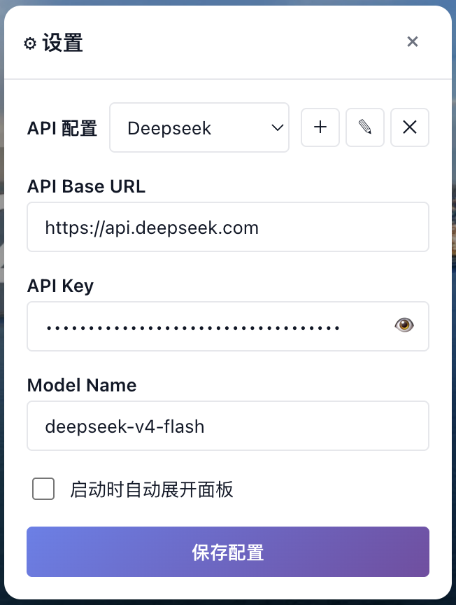

[中文](./README.zh-CN.md) | **English**

  

<h1 align="center">Goby</h1>

  <strong>The open-source agent runtime for the web.</strong>

  Goby gives any LLM a set of tools to operate the page in front of you — query, fill, click, screenshot, evaluate. Bring your own model. Talk to it in plain language. It runs entirely in your browser; there is no backend.

  

---

## Capabilities

| | |
| --- | --- |
| **Tools for the live web** | 19 built-in tools — query, list, fill, click, check, select, submit, wait, evaluate, screenshot, analyze, navigate, open_tab, list_tabs, close_tab, finish_workflow, and more. The page is the agent's workspace. |
| **Bring your own model** | Any OpenAI-compatible endpoint — OpenAI, DeepSeek, Qwen, GLM, or your own. Multiple profiles, switch on the fly. |
| **A real tool-calling loop** | Streaming responses. Multi-step reasoning across chained tool calls. Up to 50 rounds per turn, 50 tools per session, 15 s per-tool timeout. Stop button to interrupt in-progress execution. |
| **Cross-page autonomous navigation** | Agent can navigate to other pages, open new tabs, run tasks on them, and return results — all automatically. Worker tab progress streams back to the chat tab in real time. |
| **No backend, ever** | Everything runs in your browser. Your API key and your conversations never touch a Goby-controlled server. |
| **Isolated by design** | Shadow DOM keeps the panel out of the page — and the page out of the panel. DOMPurify sanitizes every LLM payload; user input uses `textContent`, never `innerHTML`. |
| **Read it in an afternoon** | ~5,500 lines of vanilla JS, no framework, no build step, no transpile. The whole runtime fits in your head. |

## Preview

<table>
  <tr>
    <td width="50%" align="center"></td>
    <td width="50%" align="center"></td>
  </tr>
  <tr>
    <td align="center"><em>First open — Goby greets you with its capabilities</em></td>
    <td align="center"><em>Tool call in action — <code>page_analyze</code> returns a summary</em></td>
  </tr>
</table>

## Installation

1. Clone or download this repo.
2. Open `chrome://extensions` in Chrome (or any Chromium browser).
3. Enable **Developer mode** (top-right toggle).
4. Click **Load unpacked** → select the project root directory.
5. Pin the Goby icon to your toolbar. Navigate to any web page, then click the floating ball at the bottom-right (or the toolbar icon) to open the panel.

## Configuration

1. Click the toolbar icon → **⚙ Settings** (or the gear icon inside the panel).
2. Add a profile:

   

     
   

   - **API Base URL** — e.g. `https://api.openai.com/v1` or your provider's OpenAI-compatible endpoint.
   - **API Key** — stored locally in `chrome.storage.local`, never transmitted except to the endpoint you configure.
   - **Model** — e.g. `gpt-4o-mini`, `qwen-plus`, `deepseek-chat`.
3. Save. The active profile is used for the next message.

## Usage

Open the panel and just talk to it:

- *"Fill the search box with 'chrome extensions' and submit"*
- *"List all buttons on this page"*
- *"Take a screenshot of the page (excluding the panel)"*
- *"What's 23 × 17 + 4?"*

The agent loops: LLM → tool calls → tool results → LLM → … until it has a final text reply (or hits the 50-round cap).

For **cross-page tasks**, the agent can open new tabs, navigate to different URLs, execute workflows on them, and return results:

- *"Open Google, search for 'web agent', and summarize the top 3 results"*
- *"Navigate to the GitHub repo and list all the sections in the README"*
- *"Open the support site and find the user manual for enterprise routers"*

## Privacy

Goby is designed to send your data to exactly one place: the LLM endpoint you configured.

- **API keys** live in `chrome.storage.local` on your machine. They are only sent to the API Base URL you entered — nowhere else.
- **Page content and your conversation** are sent only to your configured LLM endpoint as part of the chat completion request.
- **No telemetry, no analytics, no "phone home".** No request is made to any Goby-controlled server. You can verify this by inspecting `background.js` (the only place network calls happen) or by watching the Network tab in DevTools.
- **Vendored libraries** (`lib/marked.min.js`, `lib/purify.min.js`) are bundled locally — no CDN, no runtime fetch.

## Known Limitations

- **Browser-internal pages** (`chrome://`, `chrome-extension://`, `about:`) are off-limits — Chrome blocks content scripts there. The Web Store and most settings pages are also restricted.
- **`file://` pages** require you to toggle "Allow access to file URLs" in the extension's details page.
- **Strict CSP sites** may block `page_evaluate`'s injected scripts. The other tools (DOM queries, fills, clicks) still work because they operate through Chrome's own APIs.
- **`data:` URLs are not supported** — Chrome blocks content script injection on `data:` URLs. Navigating to a `data:` URL will cause the agent to stop permanently. Use `page_evaluate` to create content inline instead.
- **Cross-origin session isolation** — Sessions are scoped by origin. Navigating to a different subdomain creates a new session (context is inherited from the previous origin).

## License

[MIT](./LICENSE) © Spark
